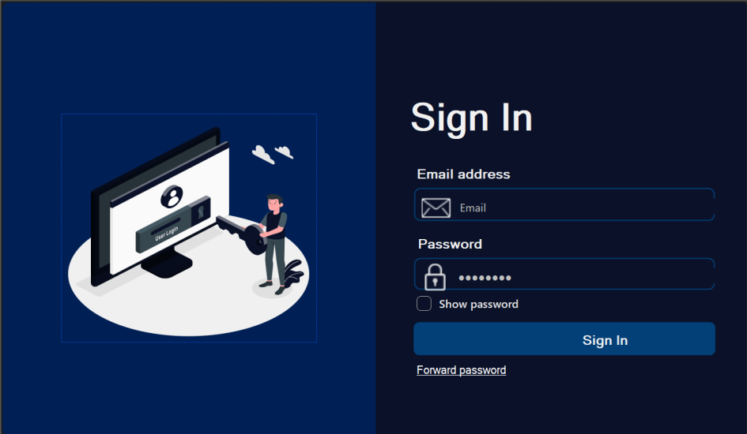
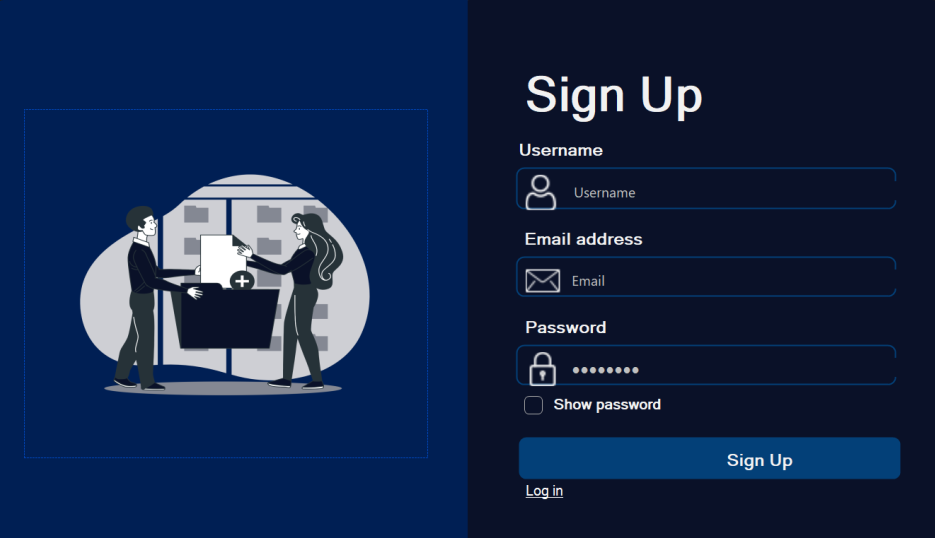
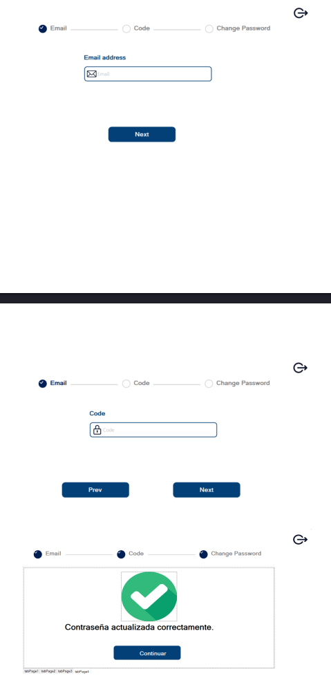
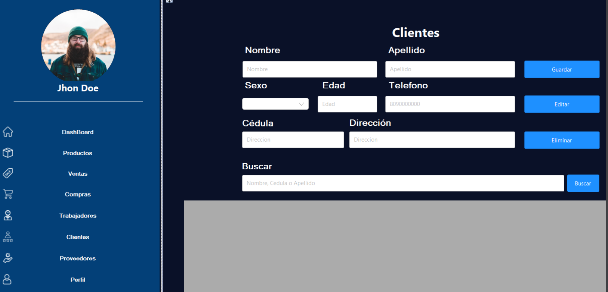

# Nombre proyecto: JC – Facturation System

## Participantes

- **Cristopher Zaiz**
- **José Almando Dominique Yan**

---

### Login

Esta vista tiene como objetivo permitir a los usuarios poder ingresar a la aplicación.

### Sign Up

Esta vista tiene como objetivo permitir registrar usuarios en la aplicación.

### Recover Password

Esta vista tiene como objetivo restablecer o cambiar la contraseña de un usuario.

### Vista del dashboard

Esta vista tiene como objetivo ser un medio de navegación hacia las distintas vista de la aplicación, teniendo en cuenta que la más importante de estas es la de clientes la cual contiene las acciones para trabajar con dicha entidad de nuestra aplicación.

